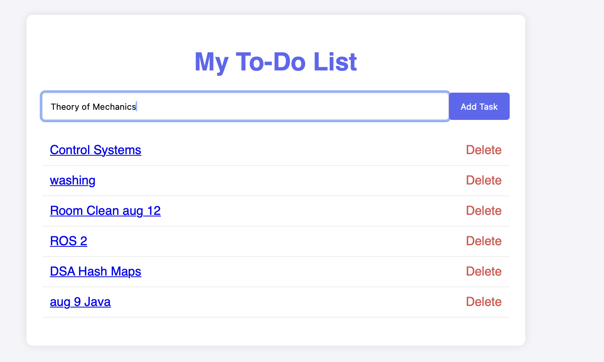
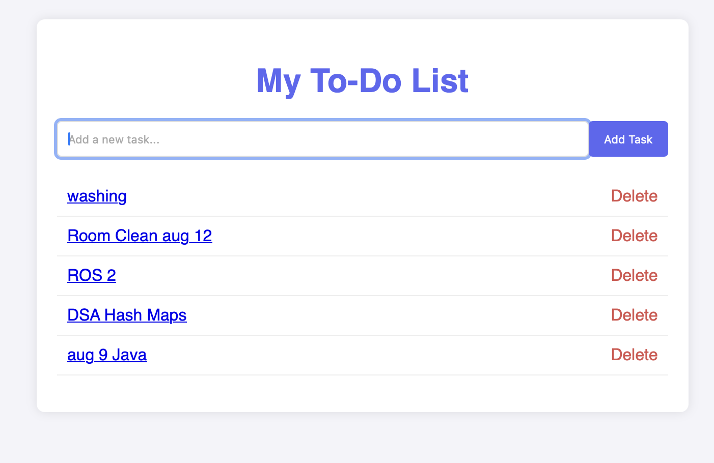

# 📝 **To-Do List Application (Django)**

A simple **web-based To-Do List** built using the **Django** framework.
Easily **add** and **delete** tasks, with data stored persistently in a database.
Frontend is powered by **HTML + CSS** for a clean, minimal interface.

---

## ✨ **Features**

* ➕ **Add new tasks** – Input a task and add it to your list.  

   

* ❌ **Delete tasks** – Remove tasks instantly.
* 💾 **Persistent storage** – Tasks remain saved even after restart.
  

---

## 🛠 **Technologies Used**

* 🐍 **Python** – Core programming language
* 🎯 **Django** – Backend framework
* 🖼 **HTML** – Page structure
* 🎨 **CSS** – Styling

---

## 🚀 **Setup & Installation**

You can set up the project either using **PyCharm** or directly via the **terminal**.

---

### **Option 1 – Using PyCharm** 💻

1. **Create a Django Project**

   * Open PyCharm → **New Project** → Select **Django** 🐍
   * PyCharm will create the required project structure automatically.

2. **Create a Django App**
   Open PyCharm’s terminal and run:

   ```bash
   python manage.py startapp todo
   ```

➡️ Continue with **[Common Configuration](#common-configuration)**

---

### **Option 2 – Using Terminal** 🖥

1. **Install Django**
   It’s recommended to use a virtual environment:

   ```bash
   python -m venv venv
   source venv/bin/activate  # Windows: venv\Scripts\activate
   pip install Django
   ```

2. **Create a Django Project**

   ```bash
   django-admin startproject myproject
   cd myproject
   ```

➡️ Continue with **[Common Configuration](#common-configuration)**

---

## ⚙ **Common Configuration**

After creating the project and app:

### **1. Register the App** 📌

Edit `myproject/settings.py`:

```python
INSTALLED_APPS = [
    'django.contrib.admin',
    'django.contrib.auth',
    'django.contrib.contenttypes',
    'django.contrib.sessions',
    'django.contrib.messages',
    'django.contrib.staticfiles',
    'todo',  # Add your app here
]
```

---

### **2. Create the Task Model** 🗂

In `todo/models.py`:

```python
from django.db import models

class Task(models.Model):
    title = models.CharField(max_length=200)
    created = models.DateTimeField(auto_now_add=True)

    def __str__(self):
        return self.title
```

---

### **3. Apply Migrations** 📦

```bash
python manage.py makemigrations
python manage.py migrate
```

---

### **4. Create an Admin User** 🔑

```bash
python manage.py createsuperuser
```

---

### **5. Register Model in Admin** 🗝

In `todo/admin.py`:

```python
from django.contrib import admin
from .models import Task

admin.site.register(Task)
```

---

### **6. Create Views** 👀

In `todo/views.py`:

```python
from django.shortcuts import render, redirect
from .models import Task

def index(request):
    tasks = Task.objects.all()
    return render(request, 'todo/index.html', {'tasks': tasks})

def addTask(request):
    if request.method == 'POST':
        title = request.POST['title']
        Task.objects.create(title=title)
    return redirect('index')

def deleteTask(request, pk):
    task = Task.objects.get(id=pk)
    task.delete()
    return redirect('index')
```

---

### **7. Configure URLs** 🌐

**`todo/urls.py`**:

```python
from django.urls import path
from . import views

urlpatterns = [
    path('', views.index, name='index'),
    path('add/', views.addTask, name='add'),
    path('delete/<str:pk>/', views.deleteTask, name='delete'),
]
```

**`myproject/urls.py`**:

```python
from django.contrib import admin
from django.urls import path, include

urlpatterns = [
    path('admin/', admin.site.urls),
    path('', include('todo.urls')),
]
```

---

### **8. Create Templates** 🎨

Inside `todo/templates/todo/`, create `index.html`:

```html
<!DOCTYPE html>
<html>
<head>
    <title>My To-Do List</title>
</head>
<body>
    <h1>📝 My To-Do List</h1>
    <form method="POST" action="">
        
        <input type="text" name="title" placeholder="Add a new task...">
        <button type="submit">Add Task ➕</button>
    </form>
    <ul>
        
            <li>
                {{ task.title }}
                <a href="">❌ Delete</a>
            </li>
        
    </ul>
</body>
</html>
```

---

### **9. Run the Application** 🏃‍♂️

```bash
python manage.py runserver
```

* 🌍 Visit **[http://127.0.0.1:8000/](http://127.0.0.1:8000/)** → To-do list
* 🔐 Visit **[http://127.0.0.1:8000/admin/](http://127.0.0.1:8000/admin/)** → Admin panel

---